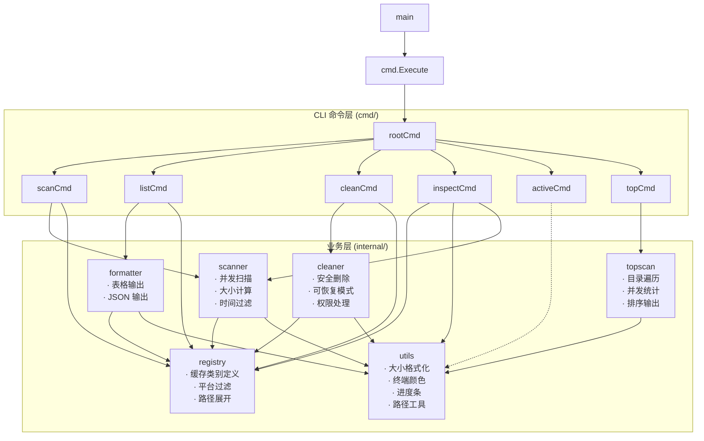
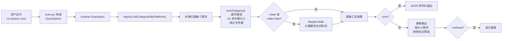
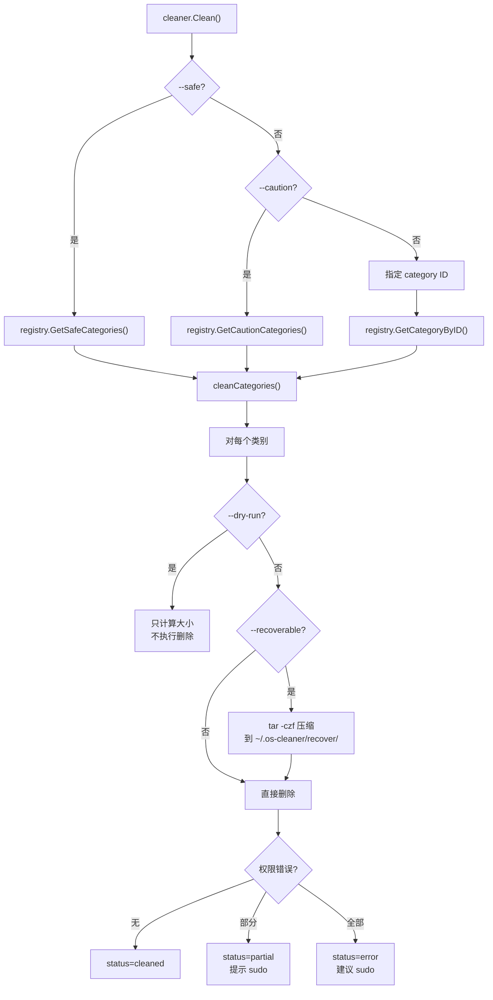
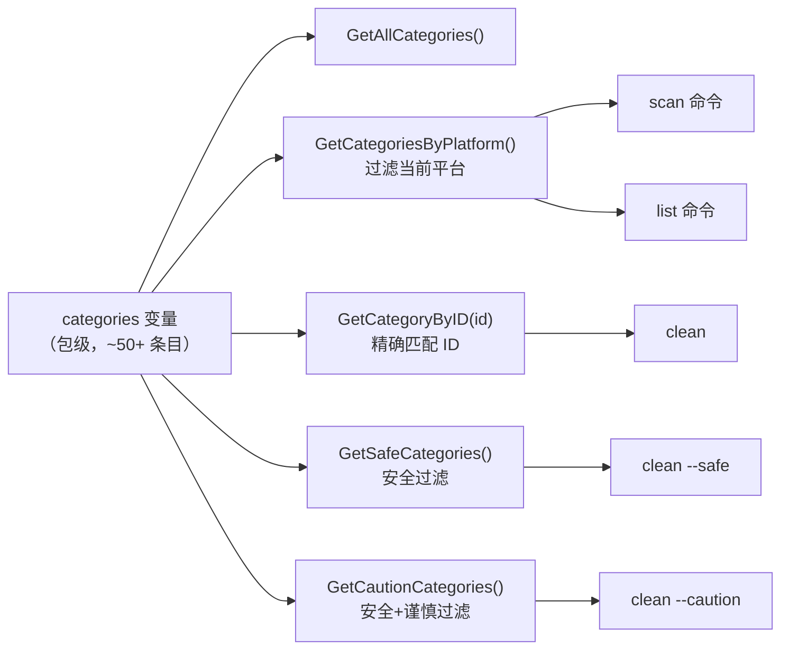

# 架构设计与模块分析

> 最后更新于 2026-06-16

## 分层架构

OS Cleaner 采用经典的三层 CLI 架构：

```
┌─────────────────────────────────────────────────┐
│                    CLI 层 (cmd/)                 │
│     命令定义 · 参数解析 · 用户交互编排           │
│  root.go  scan.go  list.go  clean.go            │
│  inspect.go  active.go  top.go                  │
├─────────────────────────────────────────────────┤
│                  业务层 (internal/)              │
│  场景能力         │    领域模型    │   工具支持   │
│  scanner/ (扫描)  │  registry/    │  utils/     │
│  cleaner/ (清理)  │  (缓存类别)   │  (通用工具)  │
│  topscan/ (大文件) │               │             │
│  formatter/ (列表) │               │             │
├─────────────────────────────────────────────────┤
│              系统层 (OS + Go Stdlib)             │
│    文件系统 · os/exec · encoding/json · sync    │
└─────────────────────────────────────────────────┘
```

### 职责边界

| 层 | 职责 | 关键约束 |
|----|------|----------|
| **CLI 层** | 定义命令和 flags，组合业务模块 | 不包含业务逻辑，只做编排和参数传递 |
| **业务层** | 实现具体能力，操作领域模型 | 不直接处理 CLI 细节 |
| **系统层** | Go 标准库 + 系统命令 | 不引入外部依赖（仅 cobra） |

## 模块依赖关系



**关键依赖关系**：

- `registry` 是所有命令的基石——它提供了"哪些路径可以清理"的权威数据
- `utils` 是纯工具模块，被所有业务模块依赖，但`utils`本身只依赖标准库
- `scanner`和`cleaner`都依赖`registry`来获取要操作的类别列表
- CLI 层负责在命令之间编排逻辑（如`inspect`命令在某些路径不存在时会回退到`scanner`模式）

## 核心数据模型

### CacheCategory（缓存类别）

```go
type CacheCategory struct {
    ID          string      // 唯一标识，如 "npm-cache"
    Name        string      // 显示名称，如 "npm Cache"
    Description string      // 说明文本
    Platforms   []string    // 适用平台：macos / linux / all
    SafetyLevel SafetyLevel // Safe / Caution / Dangerous
    Paths       []PathRule  // 一个或多个路径规则
    CleanCmd    string      // 可选：专门的清理命令（优先于直接删除）
}
```

模型设计要点：

- **单一路径 vs 多条路径**：一个类别可以对应多个路径（如 VSCode Cache 在 macOS 和 Linux 上路径不同，由 `GetCategoriesByPlatform()` 过滤）
- **CleanCmd 可选**：优先使用工具自带的清理命令（如 `npm cache clean --force`），而不是直接 `rm -rf`
- **SafetyLevel 是过滤的第一道防线**：`clean --safe` 只在 `SafetyLevel == Safe` 的类别上执行

### 数据流示例——scan 命令



## 并发模型

项目在多处使用 Go 并发原语加速扫描：

### scan 命令的并发扫描

```go
resultsChan := make(chan ScanResult, len(categories))

for _, cat := range categories {
    wg.Add(1)
    go func(cat CacheCategory) {
        defer wg.Done()
        result := scanCategory(cat, opts)
        progress.Increment(cat.Name)
        resultsChan <- result
    }(cat)
}

go func() {
    wg.Wait()
    close(resultsChan)
}()
```

特点：
- 每个类别一个 goroutine，并发执行 `du` 系统命令
- 通过 `chan` 收集结果，避免手动锁
- 结合 `Progress` 进度条展示实时状态

### top 命令的并发统计

```go
for i, entry := range entries {
    wg.Add(1)
    go func(idx int, e os.DirEntry) {
        defer wg.Done()
        // 递归遍历子目录，使用 atomic.Int64 累加
        // ...
    }(i, entry)
}
wg.Wait()
```

使用 `sync/atomic.Int64` 而非 Mutex 来保证并发安全，性能更好。

## 平台适配策略

项目通过 `runtime.GOOS` 判断当前系统（`internal/registry/registry.go:107`）：

```go
func getCurrentPlatform() string {
    switch runtime.GOOS {
    case "darwin": return "macos"
    case "linux":  return "linux"
    // ...
}
```

每个 `CacheCategory` 的 `Platforms` 字段声明适用平台。`GetCategoriesByPlatform()` 在运行时做过滤：

- `"macos"`：macOS 专属（Xcode、Homebrew、Safari、macOS Library 等）
- `"linux"`：Linux 专属（apt/dnf/pacman）
- `"all"`：跨平台（npm、Go、Cargo、通用浏览器缓存）

## 安全删除机制



### 权限处理的细化策略（`cleaner.go:260-297`）

```
safeRemoveWithDetails() 返回 (deletedSize, errors[])

case 1: 完全成功 → deletedSize > 0, errors = []
case 2: 部分成功 → deletedSize > 0, errors = [因权限失败的路径...]
         → status = "partial"，提示可加 sudo 重试
case 3: 全部失败 → deletedSize = 0, errors = [全部路径...]
         → status = "error"，明确提示需要 sudo

错误判断：strings.Contains(err.Error(), "permission")
          或 "Operation not permitted"
```

## 缓存类别注册机制

所有内置类别定义在 `internal/registry/categories.go` 的包级变量 `categories` 中。



设计特点：
- **数据驱动**：类别定义是纯数据，不包含行为逻辑
- **扩展友好**：添加新类别只需在 `categories` 切片中追加条目，无需修改其他代码
- **平台自感知**：运行时自动适配当前操作系统

## JSON 输出机制

几乎所有命令都支持 `--json` 标志，通过统一的模式实现：

```go
if opts.JSON {
    return outputJSON(results)  // json.MarshalIndent → fmt.Println
}
return outputTable(results, ...)  // 终端表格
```

`formatter` 包为 `list` 命令提供同样的双模式输出。这种模式让工具既可以交互使用，也便于被脚本或其他工具调用。
