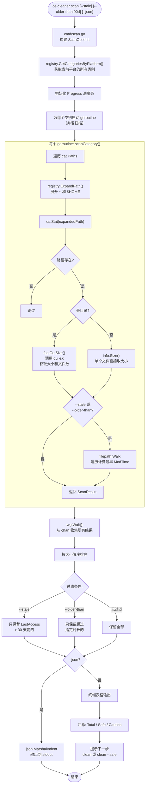
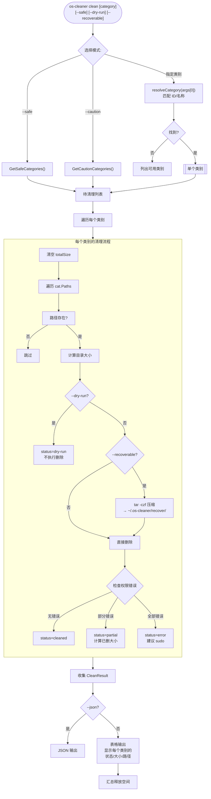
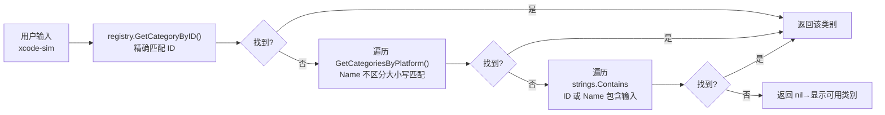
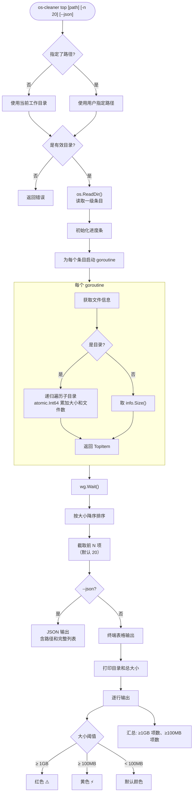
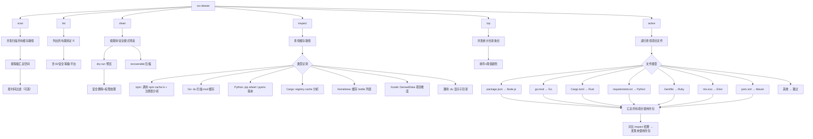

# 核心流程说明

> 最后更新于 2026-06-16

本文档用流程图说明 OS Cleaner 的 3 个核心工作流，以及类别匹配的解析流程。

---

## 1. 扫描流程（scan）

这是最常用的命令，展示所有缓存类别占用的磁盘空间。



### 扫描的关键细节

**大小计算策略**（`internal/scanner/scanner.go:149-173`）：

```
fastGetSize():
  ┌─ macOS/Linux: du -sk <path>
  │  输出: "12345    /path/to/dir"
  │  解析: 12345 KB → 乘以 1024 → bytes
  │  文件数: 估算值 size / 4096（平均文件大小 4KB）
  │
  └─ 为什么用 du 而非 filepath.Walk？
     - du 是 C 实现的，遍历目录远快于 Go 的 filepath.Walk
     - 对于包含数十万文件的大缓存目录，差距可达 10x-100x
```

**时间过滤机制**（`internal/scanner/scanner.go:175-201`）：

```
calculateDirSizeAndTime():
  ┌─ 遍历目录所有文件，记录：
  │   - 最新 ModTime（latestAccess）
  │   - 最早 ModTime（oldestAccess）
  │
  └─ 这只在 --stale 或 --older-than 时执行
     普通 scan 不会触发遍历，以保持速度
```

---

## 2. 清理流程（clean）



### 类别名称解析过程（`cmd/clean.go:69-94`）



这意味着用户输入 `xcode` 即可匹配 `xcode-deriveddata`、`xcode-simulator` 等，无需完整 ID。

---

## 3. 大文件扫描流程（top）



### 大小阈值颜色编码

| 大小 | 颜色 | 标记 | 代码位置 |
|------|------|------|----------|
| ≥ 1GB (1073741824 bytes) | 红色 | `⚠️` | `topscan.go:32` `DangerThreshold` |
| ≥ 100MB (104857600 bytes) | 黄色 | `⚡` | `topscan.go:31` `WarnThreshold` |
| < 100MB | 默认 | 无 | — |

---

## 4. 完整命令关系总图


